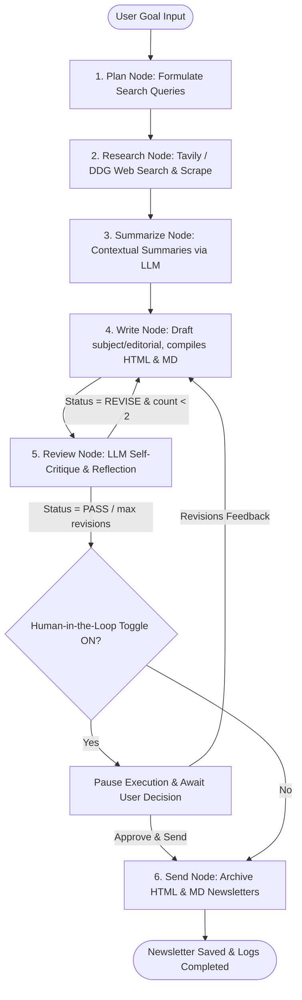

# Autonomous Newsletter Agent


A stateful, multi-agent AI system designed to autonomously research, summarize, critique, and compose weekly HTML tech newsletters based on natural language goals, built using **LangGraph**, **FastAPI**, and a sleek **React (Vite)** dashboard styled with premium **Vanilla CSS**.

---

## Features
- **Goal Input**: Initiates the agent with a goal like *"Create a weekly newsletter on latest AI agent news and send it to our subscribers."*
- **Stateful Multi-Step Reasoning**: Orchesrated using LangGraph:
  `Plan ➔ Research (Web Search) ➔ Scrape Content ➔ Summarize ➔ Draft Layout ➔ Self-Reflection Critique ➔ Human-in-the-Loop Interrupt ➔ Simulated Sending (File Writer)`
- **Resilient Search & Scraping**: Uses Tavily Search when available, and automatically falls back to **DuckDuckGo search** (100% free, keyless) + **BeautifulSoup** scraping.
- **Self-Reflection & Critique**: An internal editor agent evaluates drafts and auto-triggers corrections (up to 2 revisions) before human review.
- **Human-in-the-Loop (HITL)**: Supports a toggle between fully autonomous operation and HITL mode, which pauses the workflow to allow human review, feedback loops, or direct approval.
- **Premium UI**: Glassmorphic dark mode dashboard with real-time logs terminal, simulated stepper pipeline, and interactive side-by-side newsletter preview (live rendering iframe vs. HTML source code).

---

## Workflow Architecture

The agent orchestrates the compilation of newsletters using a stateful LangGraph layout featuring automated critiques and human checkpoint interrupts:



---

## Project Structure
```
newsletter-agent/
├── backend/
│   ├── app/
│   │   ├── __init__.py
│   │   ├── agent.py          # LangGraph state machine, nodes, and routing
│   │   ├── tools.py          # Search, Scraping, Summarizing, and HTML compilation tools
│   │   └── main.py           # FastAPI server and REST endpoints
│   ├── requirements.txt      # Python dependencies
│   ├── test_imports.py       # Import verification script
│   └── .env                  # Persistent API credentials
├── frontend/
│   ├── src/
│   │   ├── App.jsx           # Main React UI Dashboard
│   │   ├── App.css           # Custom Glassmorphic styles
│   │   ├── index.css         # Typography, reset, and core variables
│   │   └── main.jsx          # Entry point
│   ├── index.html            # HTML page (SEO/Meta-optimized)
│   └── package.json          # Node configuration & dependencies
└── README.md                 # Setup and user guide
```

---

## Getting Started

### 1. Backend Setup
1. Open a terminal and navigate to the backend directory:
   ```bash
   cd backend
   ```
2. Activate the virtual environment (Windows):
   ```bash
   venv\Scripts\activate
   ```
3. Run the FastAPI development server:
   ```bash
   python -m uvicorn app.main:app --host 127.0.0.1 --port 8000 --reload
   ```
The backend API documentation will be available at `http://127.0.0.1:8000/docs` and outputs will be saved in `backend/output/`.

### 2. Frontend Setup
1. Open another terminal and navigate to the frontend directory:
   ```bash
   cd frontend
   ```
2. Install npm packages (already done in workspace setup):
   ```bash
   npm install
   ```
3. Launch the Vite development server:
   ```bash
   npm run dev
   ```
Open the local browser link printed in your terminal (usually `http://localhost:5173`).

---

## Operating the Agent

1. **Configuring Credentials**: Click **Settings** in the top-right corner of the web dashboard. Enter your `GEMINI_API_KEY` (highly recommended) or `OPENAI_API_KEY`. If you don't have a Tavily Search key, leave it blank; the agent will automatically use **DuckDuckGo search** without any cost.
2. **Submit Goal**: Enter your custom weekly newsletter goal or use the default preset, configure your LLM brain, toggle **Human-in-the-Loop** mode ON, and click **Generate Newsletter**.
3. **Trace Execution**: View the **Agent Logs Terminal** to see the state transitions (e.g. Planning, Scraping content, Summarizing, and Critique results).
4. **Human Review Loop**:
   - If Human-in-the-Loop is toggled ON, the workflow will pause. The **Newsletter Preview** tab will render the generated newsletter in real-time, and a banner will prompt you for action.
   - Click **Approve & Send** to finalize the document.
   - Or click **Provide Revisions** to enter constructive feedback (e.g. *"Make the tone more professional and shorten the intro paragraph"*). The agent will digest this feedback, loop back to the drafting stage, apply updates, and pause for your review again.
5. **Simulated Sending**: Once approved, the agent saves the HTML newsletter and raw subject line as timestamped files in the `backend/output/` directory and flashes a success notification.
